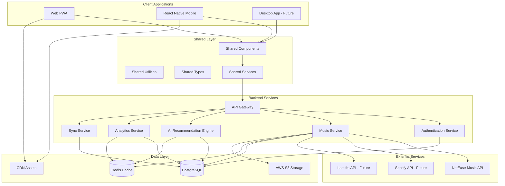
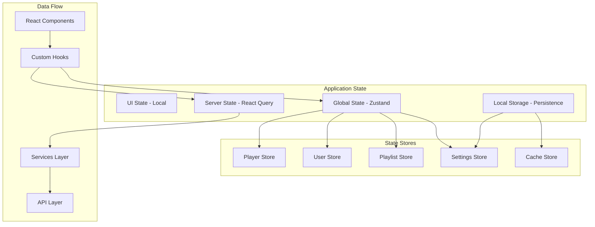
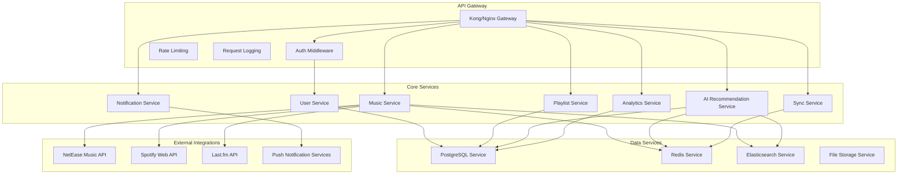
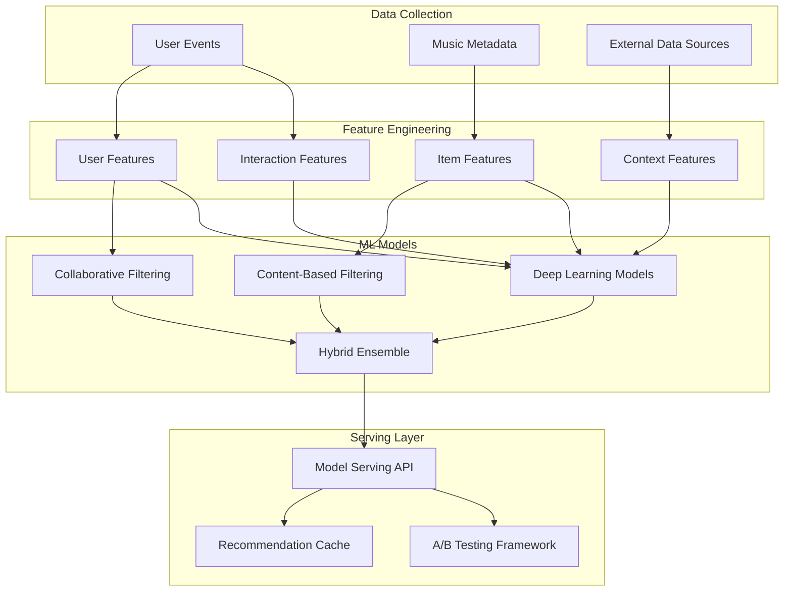
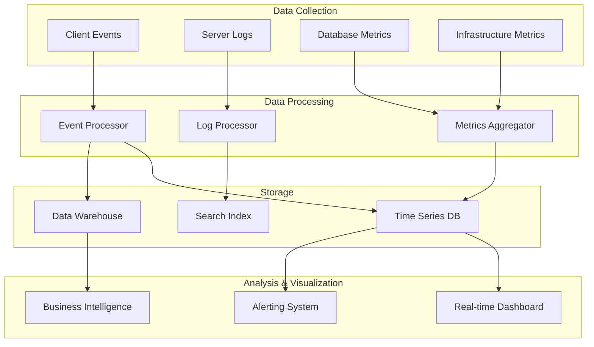
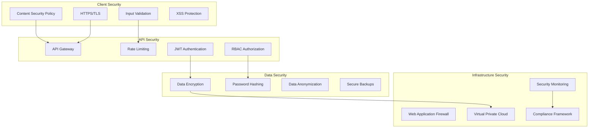

# Universal Music Player - Architecture Documentation

## 🏗 System Architecture Overview

Universal Music Player is built using a modern, scalable, cross-platform architecture that supports web (PWA), mobile (React Native), and future desktop applications from a shared codebase.



## 🎯 Design Principles

### 1. Cross-Platform Consistency
- **Shared Component Library**: 80% code reuse between platforms
- **Unified Design System**: Consistent UI/UX across all platforms
- **Platform-Specific Optimizations**: Native feel on each platform

### 2. Performance First
- **Intelligent Caching**: ML-powered predictive caching
- **Lazy Loading**: Components and routes loaded on demand
- **Bundle Optimization**: Tree shaking and code splitting
- **Memory Management**: Efficient resource cleanup

### 3. Scalable Architecture
- **Microservices Backend**: Independently scalable services
- **Event-Driven Design**: Loose coupling between components
- **Horizontal Scaling**: Support for multiple instances
- **Load Balancing**: Distributed request handling

### 4. Real-Time Features
- **WebSocket Connections**: Live sync and notifications
- **Push Notifications**: Cross-platform notification system
- **Live Updates**: Real-time UI updates without polling

## 📱 Frontend Architecture

### Monorepo Structure

```
packages/
├── shared/                 # Shared code between platforms
│   ├── src/
│   │   ├── components/     # Reusable UI components
│   │   ├── hooks/          # Custom React hooks
│   │   ├── services/       # Business logic services
│   │   ├── stores/         # Zustand state management
│   │   ├── types/          # TypeScript type definitions
│   │   ├── utils/          # Utility functions
│   │   └── constants/      # Application constants
│   └── package.json
├── web/                    # React web application
│   ├── src/
│   │   ├── components/     # Web-specific components
│   │   ├── pages/          # Route components
│   │   ├── hooks/          # Web-specific hooks
│   │   ├── styles/         # CSS and styling
│   │   └── public/         # Static assets
│   ├── vite.config.ts
│   └── package.json
└── mobile/                 # React Native application
    ├── src/
    │   ├── components/     # Mobile-specific components
    │   ├── screens/        # Screen components
    │   ├── navigation/     # Navigation configuration
    │   └── hooks/          # Mobile-specific hooks
    ├── app.json
    └── package.json
```

### Technology Stack

#### Core Technologies
- **React 19**: Latest React with concurrent features
- **TypeScript 5.8+**: Static typing and modern language features
- **Zustand**: Lightweight state management
- **React Query/TanStack Query**: Server state management
- **Framer Motion**: Animations and transitions

#### Web Platform
- **Vite**: Fast build tool and development server
- **Tailwind CSS**: Utility-first CSS framework
- **PWA**: Service Worker and offline functionality
- **Web Audio API**: Audio processing and visualization

#### Mobile Platform
- **React Native**: Cross-platform mobile development
- **Expo 51**: Development platform and build tools
- **React Navigation 7**: Navigation and routing
- **React Native Reanimated 3**: High-performance animations

### State Management Architecture



#### Zustand Store Structure

```typescript
// Player Store
interface PlayerState {
  currentSong: Song | null;
  isPlaying: boolean;
  queue: Song[];
  currentIndex: number;
  volume: number;
  repeatMode: RepeatMode;
  shuffleMode: boolean;
  
  // Actions
  play: (song?: Song) => void;
  pause: () => void;
  next: () => void;
  previous: () => void;
  setVolume: (volume: number) => void;
  addToQueue: (songs: Song[]) => void;
}

// User Store
interface UserState {
  user: User | null;
  isAuthenticated: boolean;
  preferences: UserPreferences;
  
  // Actions
  login: (credentials: LoginCredentials) => Promise<void>;
  logout: () => void;
  updatePreferences: (preferences: Partial<UserPreferences>) => void;
}

// Playlist Store
interface PlaylistState {
  playlists: Playlist[];
  currentPlaylist: Playlist | null;
  
  // Actions
  createPlaylist: (playlist: CreatePlaylistRequest) => Promise<Playlist>;
  updatePlaylist: (id: string, updates: Partial<Playlist>) => Promise<void>;
  deletePlaylist: (id: string) => Promise<void>;
  addSongToPlaylist: (playlistId: string, songId: string) => Promise<void>;
}
```

### Component Architecture

#### Component Hierarchy

```
App
├── Router
│   ├── PublicRoutes
│   │   ├── Login
│   │   ├── Register
│   │   └── Landing
│   └── PrivateRoutes
│       ├── Layout
│       │   ├── Sidebar
│       │   ├── Header
│       │   ├── Player
│       │   └── MainContent
│       ├── Home
│       ├── Search
│       ├── Library
│       ├── Playlists
│       └── Settings
└── Providers
    ├── AuthProvider
    ├── ThemeProvider
    ├── AudioProvider
    └── QueryProvider
```

#### Component Design Patterns

**1. Compound Components**
```typescript
// Player compound component
<Player>
  <Player.Cover />
  <Player.Info />
  <Player.Controls>
    <Player.PlayButton />
    <Player.NextButton />
    <Player.PrevButton />
  </Player.Controls>
  <Player.Progress />
  <Player.Volume />
</Player>
```

**2. Render Props / Children Functions**
```typescript
// Data fetching with render props
<MusicSearch query={query}>
  {({ data, loading, error }) => (
    <div>
      {loading && <LoadingSpinner />}
      {error && <ErrorMessage error={error} />}
      {data && <SearchResults results={data} />}
    </div>
  )}
</MusicSearch>
```

**3. Custom Hooks Pattern**
```typescript
// Business logic in custom hooks
function usePlayer() {
  const { currentSong, isPlaying, play, pause } = usePlayerStore();
  const { mutate: trackPlay } = useTrackPlayback();
  
  const handlePlay = useCallback((song: Song) => {
    play(song);
    trackPlay(song.id);
  }, [play, trackPlay]);
  
  return { currentSong, isPlaying, play: handlePlay, pause };
}
```

### Cross-Platform Component Strategy

#### Shared Components (packages/shared)
```typescript
// Shared component interface
interface ButtonProps {
  children: ReactNode;
  variant: 'primary' | 'secondary' | 'outline';
  size: 'small' | 'medium' | 'large';
  disabled?: boolean;
  onPress: () => void;
}

// Platform-agnostic implementation
export const Button: FC<ButtonProps> = ({ 
  children, 
  variant, 
  size, 
  disabled, 
  onPress 
}) => {
  return (
    <PlatformButton
      style={[
        baseStyles.button,
        variantStyles[variant],
        sizeStyles[size],
        disabled && baseStyles.disabled
      ]}
      onPress={onPress}
      disabled={disabled}
    >
      {children}
    </PlatformButton>
  );
};
```

#### Platform-Specific Adaptations
```typescript
// Web implementation (packages/web)
const PlatformButton = styled.button<ButtonProps>`
  // Web-specific styles
  cursor: pointer;
  transition: all 0.2s ease;
  
  &:hover {
    transform: translateY(-2px);
  }
`;

// Mobile implementation (packages/mobile)
const PlatformButton = ({ children, onPress, ...props }) => (
  <TouchableOpacity onPress={onPress} {...props}>
    <Animated.View>
      {children}
    </Animated.View>
  </TouchableOpacity>
);
```

## 🔧 Backend Architecture

### Microservices Design

#### Service Architecture


#### Service Communication Patterns

**1. Synchronous Communication (REST APIs)**
```typescript
// Inter-service communication via HTTP
class PlaylistService {
  async createPlaylist(userId: string, data: CreatePlaylistData) {
    // Validate user exists
    const user = await this.userService.getUser(userId);
    
    // Create playlist
    const playlist = await this.playlistRepository.create({
      ...data,
      userId,
      createdAt: new Date()
    });
    
    // Track analytics
    await this.analyticsService.trackEvent('playlist_created', {
      userId,
      playlistId: playlist.id
    });
    
    return playlist;
  }
}
```

**2. Asynchronous Communication (Event Bus)**
```typescript
// Event-driven communication
interface DomainEvent {
  id: string;
  type: string;
  aggregateId: string;
  payload: any;
  timestamp: Date;
}

class EventBus {
  async publish(event: DomainEvent) {
    // Publish to message queue (Redis/RabbitMQ)
    await this.messageQueue.publish(event.type, event);
  }
  
  subscribe(eventType: string, handler: EventHandler) {
    this.messageQueue.subscribe(eventType, handler);
  }
}

// Usage example
eventBus.publish({
  id: uuid(),
  type: 'song_played',
  aggregateId: songId,
  payload: { userId, songId, timestamp: new Date() },
  timestamp: new Date()
});
```

### Data Architecture

#### Database Design (PostgreSQL)

**Core Tables Structure:**
```sql
-- Users
CREATE TABLE users (
  id UUID PRIMARY KEY DEFAULT gen_random_uuid(),
  email VARCHAR(255) UNIQUE NOT NULL,
  password_hash VARCHAR(255) NOT NULL,
  name VARCHAR(255) NOT NULL,
  avatar_url TEXT,
  premium BOOLEAN DEFAULT FALSE,
  preferences JSONB DEFAULT '{}',
  created_at TIMESTAMP DEFAULT NOW(),
  updated_at TIMESTAMP DEFAULT NOW()
);

-- Artists
CREATE TABLE artists (
  id UUID PRIMARY KEY DEFAULT gen_random_uuid(),
  name VARCHAR(255) NOT NULL,
  bio TEXT,
  avatar_url TEXT,
  external_ids JSONB DEFAULT '{}',
  metadata JSONB DEFAULT '{}',
  created_at TIMESTAMP DEFAULT NOW(),
  updated_at TIMESTAMP DEFAULT NOW()
);

-- Albums
CREATE TABLE albums (
  id UUID PRIMARY KEY DEFAULT gen_random_uuid(),
  title VARCHAR(255) NOT NULL,
  artist_id UUID REFERENCES artists(id),
  cover_url TEXT,
  release_date DATE,
  genre TEXT[],
  external_ids JSONB DEFAULT '{}',
  created_at TIMESTAMP DEFAULT NOW(),
  updated_at TIMESTAMP DEFAULT NOW()
);

-- Songs
CREATE TABLE songs (
  id UUID PRIMARY KEY DEFAULT gen_random_uuid(),
  title VARCHAR(255) NOT NULL,
  artist_id UUID REFERENCES artists(id),
  album_id UUID REFERENCES albums(id),
  duration INTEGER NOT NULL,
  track_number INTEGER,
  stream_url TEXT,
  preview_url TEXT,
  lyrics JSONB,
  external_ids JSONB DEFAULT '{}',
  metadata JSONB DEFAULT '{}',
  created_at TIMESTAMP DEFAULT NOW(),
  updated_at TIMESTAMP DEFAULT NOW()
);

-- Playlists
CREATE TABLE playlists (
  id UUID PRIMARY KEY DEFAULT gen_random_uuid(),
  name VARCHAR(255) NOT NULL,
  description TEXT,
  cover_url TEXT,
  user_id UUID REFERENCES users(id),
  is_public BOOLEAN DEFAULT FALSE,
  tags TEXT[],
  created_at TIMESTAMP DEFAULT NOW(),
  updated_at TIMESTAMP DEFAULT NOW()
);

-- Playlist Songs (Many-to-Many)
CREATE TABLE playlist_songs (
  playlist_id UUID REFERENCES playlists(id) ON DELETE CASCADE,
  song_id UUID REFERENCES songs(id) ON DELETE CASCADE,
  position INTEGER NOT NULL,
  added_at TIMESTAMP DEFAULT NOW(),
  PRIMARY KEY (playlist_id, song_id)
);

-- User Activity
CREATE TABLE user_activities (
  id UUID PRIMARY KEY DEFAULT gen_random_uuid(),
  user_id UUID REFERENCES users(id),
  activity_type VARCHAR(50) NOT NULL,
  target_type VARCHAR(50) NOT NULL,
  target_id UUID NOT NULL,
  metadata JSONB DEFAULT '{}',
  created_at TIMESTAMP DEFAULT NOW()
);
```

**Performance Optimizations:**
```sql
-- Indexes for common queries
CREATE INDEX idx_songs_artist_id ON songs(artist_id);
CREATE INDEX idx_songs_album_id ON songs(album_id);
CREATE INDEX idx_playlist_songs_playlist_id ON playlist_songs(playlist_id);
CREATE INDEX idx_user_activities_user_id ON user_activities(user_id);
CREATE INDEX idx_user_activities_created_at ON user_activities(created_at);

-- Full-text search
CREATE INDEX idx_songs_search ON songs USING gin(to_tsvector('english', title));
CREATE INDEX idx_artists_search ON artists USING gin(to_tsvector('english', name));

-- Partial indexes for performance
CREATE INDEX idx_public_playlists ON playlists(created_at) WHERE is_public = true;
```

#### Caching Strategy (Redis)

**Cache Patterns:**
```typescript
class MusicCacheService {
  // Cache-aside pattern
  async getSong(id: string): Promise<Song | null> {
    // Try cache first
    const cached = await this.redis.get(`song:${id}`);
    if (cached) {
      return JSON.parse(cached);
    }
    
    // Fetch from database
    const song = await this.songRepository.findById(id);
    if (song) {
      // Cache for 1 hour
      await this.redis.setex(`song:${id}`, 3600, JSON.stringify(song));
    }
    
    return song;
  }
  
  // Write-through pattern
  async updateSong(id: string, updates: Partial<Song>): Promise<Song> {
    const song = await this.songRepository.update(id, updates);
    
    // Update cache immediately
    await this.redis.setex(`song:${id}`, 3600, JSON.stringify(song));
    
    return song;
  }
  
  // Cache invalidation
  async invalidateSongCache(id: string): Promise<void> {
    await this.redis.del(`song:${id}`);
    // Also invalidate related caches
    await this.redis.del(`artist:songs:${song.artistId}`);
    await this.redis.del(`album:songs:${song.albumId}`);
  }
}
```

**Cache Structure:**
```
Redis Cache Keys:
├── user:{id}                    # User profile data
├── song:{id}                    # Individual song data
├── artist:{id}                  # Artist information
├── album:{id}                   # Album information
├── playlist:{id}                # Playlist data
├── search:{query}:{filters}     # Search results
├── recommendations:{userId}     # User recommendations
├── trending:songs               # Trending songs
├── session:{sessionId}          # User sessions
└── sync:{userId}               # Sync data
```

## 🤖 AI/ML Architecture

### Recommendation Engine

#### ML Pipeline Architecture


#### Model Implementation

**1. Collaborative Filtering**
```python
import numpy as np
from scipy.sparse import csr_matrix
from sklearn.decomposition import NMF

class CollaborativeFilteringModel:
    def __init__(self, n_factors=50, regularization=0.1):
        self.n_factors = n_factors
        self.regularization = regularization
        self.model = NMF(
            n_components=n_factors,
            alpha=regularization,
            random_state=42
        )
    
    def fit(self, user_item_matrix):
        """Train the collaborative filtering model"""
        self.user_factors = self.model.fit_transform(user_item_matrix)
        self.item_factors = self.model.components_
        
    def predict(self, user_id, item_ids):
        """Predict ratings for given user-item pairs"""
        user_vector = self.user_factors[user_id]
        item_vectors = self.item_factors[:, item_ids]
        
        predictions = np.dot(user_vector, item_vectors)
        return predictions
    
    def recommend(self, user_id, n_recommendations=10):
        """Generate top-N recommendations for a user"""
        predictions = self.predict(user_id, range(self.item_factors.shape[1]))
        top_items = np.argsort(predictions)[::-1][:n_recommendations]
        
        return top_items, predictions[top_items]
```

**2. Content-Based Filtering**
```python
from sklearn.feature_extraction.text import TfidfVectorizer
from sklearn.metrics.pairwise import cosine_similarity

class ContentBasedModel:
    def __init__(self):
        self.vectorizer = TfidfVectorizer(
            stop_words='english',
            ngram_range=(1, 2),
            max_features=5000
        )
        
    def fit(self, songs_metadata):
        """Train content-based model on song features"""
        # Combine text features
        content_features = songs_metadata.apply(
            lambda x: f"{x['genre']} {x['artist']} {x['album']} {x['mood']}", 
            axis=1
        )
        
        self.content_matrix = self.vectorizer.fit_transform(content_features)
        
    def recommend(self, seed_songs, n_recommendations=10):
        """Recommend songs similar to seed songs"""
        seed_indices = [self.song_to_index[song_id] for song_id in seed_songs]
        seed_vector = self.content_matrix[seed_indices].mean(axis=0)
        
        similarity_scores = cosine_similarity(seed_vector, self.content_matrix)
        similar_songs = np.argsort(similarity_scores[0])[::-1][:n_recommendations]
        
        return similar_songs, similarity_scores[0][similar_songs]
```

**3. Deep Learning Model**
```python
import tensorflow as tf
from tensorflow.keras import layers, Model

class DeepRecommendationModel:
    def __init__(self, n_users, n_items, embedding_dim=64):
        self.n_users = n_users
        self.n_items = n_items
        self.embedding_dim = embedding_dim
        self.model = self._build_model()
        
    def _build_model(self):
        # User and item embeddings
        user_input = layers.Input(shape=(), name='user_id')
        item_input = layers.Input(shape=(), name='item_id')
        context_input = layers.Input(shape=(10,), name='context_features')
        
        user_embedding = layers.Embedding(
            self.n_users, self.embedding_dim, name='user_embedding'
        )(user_input)
        item_embedding = layers.Embedding(
            self.n_items, self.embedding_dim, name='item_embedding'
        )(item_input)
        
        # Flatten embeddings
        user_vec = layers.Flatten()(user_embedding)
        item_vec = layers.Flatten()(item_embedding)
        
        # Concatenate all features
        concat = layers.Concatenate()([user_vec, item_vec, context_input])
        
        # Deep neural network
        x = layers.Dense(128, activation='relu')(concat)
        x = layers.Dropout(0.2)(x)
        x = layers.Dense(64, activation='relu')(x)
        x = layers.Dropout(0.2)(x)
        x = layers.Dense(32, activation='relu')(x)
        
        # Output layer
        output = layers.Dense(1, activation='sigmoid', name='rating')(x)
        
        model = Model(
            inputs=[user_input, item_input, context_input], 
            outputs=output
        )
        
        model.compile(
            optimizer='adam',
            loss='binary_crossentropy',
            metrics=['accuracy']
        )
        
        return model
    
    def train(self, training_data, validation_data, epochs=100):
        """Train the deep learning model"""
        self.model.fit(
            training_data,
            validation_data=validation_data,
            epochs=epochs,
            batch_size=256,
            callbacks=[
                tf.keras.callbacks.EarlyStopping(patience=10),
                tf.keras.callbacks.ReduceLROnPlateau(patience=5)
            ]
        )
```

### Real-Time Features

#### Feature Processing Pipeline
```typescript
class FeatureProcessor {
  private redis: RedisClient;
  private kafka: KafkaProducer;
  
  async processUserInteraction(event: UserInteractionEvent) {
    // Extract features from user interaction
    const features = await this.extractFeatures(event);
    
    // Update user profile in real-time
    await this.updateUserProfile(event.userId, features);
    
    // Trigger recommendation refresh if needed
    if (this.shouldRefreshRecommendations(features)) {
      await this.kafka.send({
        topic: 'recommendation_refresh',
        messages: [{
          key: event.userId,
          value: JSON.stringify(features)
        }]
      });
    }
  }
  
  private async extractFeatures(event: UserInteractionEvent) {
    return {
      timestamp: event.timestamp,
      songGenre: await this.getSongGenre(event.songId),
      timeOfDay: this.getTimeOfDay(event.timestamp),
      playDuration: event.duration,
      skipRate: await this.calculateSkipRate(event.userId),
      sessionLength: await this.getSessionLength(event.sessionId)
    };
  }
}
```

## 📊 Analytics and Monitoring

### Analytics Architecture



### Performance Monitoring

#### Key Metrics
```typescript
interface PerformanceMetrics {
  // Application Metrics
  responseTime: {
    p50: number;
    p95: number;
    p99: number;
  };
  throughput: number;
  errorRate: number;
  
  // User Experience Metrics
  loadTime: number;
  firstContentfulPaint: number;
  largestContentfulPaint: number;
  cumulativeLayoutShift: number;
  
  // Business Metrics
  activeUsers: number;
  conversionRate: number;
  retentionRate: number;
  churnRate: number;
}

class MetricsCollector {
  async recordMetric(metric: string, value: number, tags?: Record<string, string>) {
    // Send to metrics service (Prometheus, DataDog, etc.)
    await this.metricsService.record(metric, value, tags);
    
    // Real-time alerting
    if (this.isAbnormal(metric, value)) {
      await this.alertingService.sendAlert({
        metric,
        value,
        threshold: this.getThreshold(metric),
        severity: this.getSeverity(metric, value)
      });
    }
  }
}
```

## 🔒 Security Architecture

### Security Layers



### Authentication & Authorization

```typescript
// JWT-based authentication
class AuthService {
  async authenticate(token: string): Promise<User | null> {
    try {
      const payload = jwt.verify(token, this.jwtSecret) as JWTPayload;
      
      // Validate token hasn't been revoked
      const isRevoked = await this.redis.get(`revoked:${payload.jti}`);
      if (isRevoked) {
        throw new Error('Token has been revoked');
      }
      
      // Get user with permissions
      const user = await this.userRepository.findById(payload.sub);
      return user;
    } catch (error) {
      return null;
    }
  }
  
  async authorize(user: User, resource: string, action: string): Promise<boolean> {
    // Role-based access control
    const permissions = await this.getPermissions(user.roles);
    return permissions.some(p => 
      p.resource === resource && 
      p.actions.includes(action)
    );
  }
}

// Rate limiting
class RateLimiter {
  async checkLimit(key: string, limit: number, window: number): Promise<boolean> {
    const current = await this.redis.incr(key);
    
    if (current === 1) {
      await this.redis.expire(key, window);
    }
    
    return current <= limit;
  }
}
```

## 🚀 Deployment and Scaling

### Container Architecture

```dockerfile
# Multi-stage build for web application
FROM node:18-alpine AS builder
WORKDIR /app
COPY package*.json ./
RUN npm ci --only=production

COPY . .
RUN npm run build

FROM nginx:alpine AS production
COPY --from=builder /app/dist /usr/share/nginx/html
COPY nginx.conf /etc/nginx/nginx.conf
EXPOSE 80
CMD ["nginx", "-g", "daemon off;"]
```

### Kubernetes Deployment

```yaml
apiVersion: apps/v1
kind: Deployment
metadata:
  name: universal-music-player-web
spec:
  replicas: 3
  selector:
    matchLabels:
      app: universal-music-player-web
  template:
    metadata:
      labels:
        app: universal-music-player-web
    spec:
      containers:
      - name: web
        image: universalmusicplayer/web:latest
        ports:
        - containerPort: 80
        resources:
          requests:
            memory: "128Mi"
            cpu: "100m"
          limits:
            memory: "512Mi"
            cpu: "500m"
        livenessProbe:
          httpGet:
            path: /health
            port: 80
          initialDelaySeconds: 30
          periodSeconds: 10
        readinessProbe:
          httpGet:
            path: /ready
            port: 80
          initialDelaySeconds: 5
          periodSeconds: 5
```

## 📈 Future Architecture Considerations

### Scalability Roadmap

**Phase 1: Current Architecture**
- Monolithic backend with microservice preparation
- Single database with read replicas
- Basic caching and CDN

**Phase 2: Microservices Transition**
- Service decomposition and containerization
- Event-driven architecture implementation
- Advanced caching strategies

**Phase 3: Cloud-Native Scaling**
- Multi-region deployment
- Auto-scaling and load balancing
- Advanced ML pipeline automation

**Phase 4: Global Scale**
- Edge computing for low latency
- Advanced data partitioning
- Real-time global synchronization

### Technology Evolution Plan

**Short Term (6 months)**
- React Server Components adoption
- Advanced PWA features
- Enhanced mobile performance

**Medium Term (12 months)**
- Micro-frontend architecture
- Advanced AI/ML capabilities
- Real-time collaboration features

**Long Term (24 months)**
- Web3 integration possibilities
- AR/VR music experiences
- Advanced personalization AI