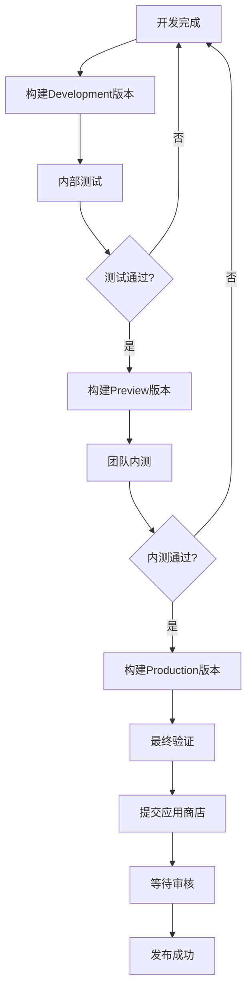

# 🚀 移动端完整发布工作流

## 📋 发布流程总览



## 🎯 Step 1: 开发版本构建和测试

### 构建开发版本
```bash
# 1. 确保共享包是最新的
npm run prebuild:shared

# 2. 构建开发版本
npm run build:development
# 或使用脚本
./scripts/build.sh development android  # 只构建Android
```

### 预期结果
- ✅ 构建时间: 3-5分钟
- ✅ 生成APK文件可直接安装
- ✅ 连接本地API服务器(localhost:3001)
- ✅ 包含调试信息和开发工具

### 测试步骤
```bash
# 安装到设备
eas build:run --platform android --latest

# 测试功能
- 登录功能
- 搜索音乐
- 播放音频（确保代理工作）
- 图片加载（确保图片代理工作）
```

## 🎯 Step 2: 预览版本构建和内测

### 构建预览版本
```bash
# 构建预览版本（连接生产API）
npm run build:preview

# 或分平台构建
./scripts/build.sh preview ios
./scripts/build.sh preview android
```

### 预期结果
- ✅ 构建时间: 5-8分钟
- ✅ 连接生产API服务器(8.134.196.44:3001)
- ✅ 启用部分性能优化
- ✅ 适合团队内测

### 分发给测试团队
```bash
# 查看构建结果
eas build:list

# 获取分享链接和二维码
# 团队成员可扫码安装
```

### 内测验证清单
- [ ] 用户注册/登录
- [ ] 音乐搜索和播放
- [ ] 歌单管理
- [ ] 图片和音频加载
- [ ] 离线功能测试
- [ ] 不同设备兼容性
- [ ] 性能和稳定性

## 🎯 Step 3: 生产版本构建

### 构建生产版本
```bash
# 完整生产版本构建
npm run build:production

# 使用高级脚本（推荐）
./scripts/build.sh production all
```

### 预期结果
- ✅ 构建时间: 8-15分钟
- ✅ 代码完全优化和混淆
- ✅ 最小化包体积
- ✅ 生产环境配置
- ✅ 符合应用商店要求

### 最终验证
```bash
# 安装生产版本进行最终测试
eas build:run --platform android --latest
eas build:run --platform ios --latest

# 验证检查清单
- [ ] 应用启动速度
- [ ] 核心功能完整性
- [ ] 无调试信息泄漏
- [ ] 包体积合理(建议<50MB)
- [ ] 崩溃率测试
```

## 🎯 Step 4: 应用商店提交

### 自动提交（推荐）
```bash
# 一键提交到所有平台
./scripts/deploy.sh production submit

# 或分别提交
eas submit --platform android --profile production
eas submit --platform ios --profile production
```

### 手动提交
```bash
# 下载构建文件
eas build:download --platform android --latest
eas build:download --platform ios --latest

# 手动上传到应用商店
```

### 应用商店配置

#### Google Play Console
```bash
# 自动提交配置
{
  "android": {
    "track": "production",        # 发布轨道
    "releaseStatus": "draft"      # 先发布为草稿
  }
}
```

#### App Store Connect
```bash
# 需要配置App Store Connect App ID
{
  "ios": {
    "ascAppId": "your-app-store-connect-app-id"
  }
}
```

## 🎯 Step 5: OTA更新发布

### 发布JavaScript更新
```bash
# 快速OTA更新（不需要重新下载应用）
npm run update:production

# 使用脚本
./scripts/deploy.sh production update
```

### OTA更新适用场景
- ✅ JavaScript代码修改
- ✅ 配置文件更新
- ✅ 样式和界面调整
- ❌ 原生依赖变更
- ❌ 权限修改

## 📊 发布监控和管理

### 构建状态监控
```bash
# 查看所有构建
eas build:list

# 查看更新历史
eas update:list

# 查看提交状态
eas submit:list
```

### 应用商店审核状态
- **Google Play**: 通常1-3天审核
- **App Store**: 通常1-7天审核

### 发布后监控
```bash
# 用户采用率
eas analytics

# 崩溃报告
# 集成Sentry或其他监控工具

# 用户反馈
# 监控应用商店评价
```

## 🔄 版本回滚

### 快速回滚（OTA）
```bash
# 回滚到上一个版本
eas update --branch production --message "Rollback to previous version"
```

### 应用商店回滚
```bash
# 在Google Play Console中停用当前版本
# 在App Store Connect中移除当前版本
```

## 🎯 完整发布脚本示例

### 全自动发布流程
```bash
#!/bin/bash
# 完整发布脚本

echo "🚀 开始完整发布流程"

# Step 1: 开发版本
echo "📱 构建开发版本..."
npm run build:development
echo "✅ 开发版本构建完成"

# Step 2: 预览版本  
echo "📱 构建预览版本..."
npm run build:preview
echo "✅ 预览版本构建完成"

# Step 3: 生产版本
echo "📱 构建生产版本..."
npm run build:production
echo "✅ 生产版本构建完成"

# Step 4: 提交应用商店
read -p "是否提交到应用商店? (y/n) " -n 1 -r
if [[ $REPLY =~ ^[Yy]$ ]]; then
    echo "📤 提交到应用商店..."
    eas submit --platform all --profile production
    echo "✅ 应用商店提交完成"
fi

echo "🎉 发布流程完成！"
```

## 💡 最佳实践

### 发布节奏建议
- **每日**: Development构建用于开发测试
- **每周**: Preview构建用于团队内测
- **每月**: Production构建用于正式发布

### 质量保证
- 所有版本都要经过自动化测试
- Preview版本需要至少1周的内测
- Production版本需要完整的回归测试

### 风险控制
- 分阶段发布（部分用户先体验）
- 监控关键指标（崩溃率、性能）
- 准备快速回滚方案

---

## 📞 支持和帮助

遇到问题时：
1. 查看构建日志: `eas build:view [BUILD_ID]`
2. 检查配置文件: `eas.json`, `app.json`
3. 重试构建: `eas build --platform android --profile production --clear-cache`
4. 社区求助: [Expo Forum](https://forums.expo.dev/)