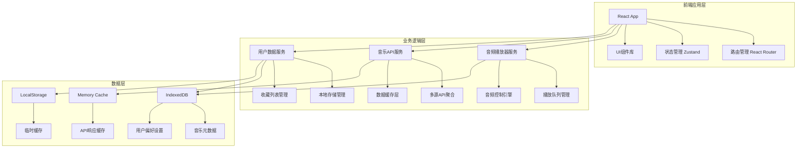

# 网易云音乐播放器 - 详细技术设计规范

## 1. 项目架构深度分析

### 1.1 整体架构设计



### 1.2 技术栈详细选型理由

#### 前端框架层
- **React 18**: 
  - 并发特性支持音频播放的流畅性
  - Suspense 优化大列表加载体验
  - 自动批处理减少不必要的重渲染
  
- **TypeScript**:
  - 强类型保证音频API调用的安全性
  - 接口定义清晰的组件和服务契约
  - 编译时错误检查提高代码质量

#### 状态管理层
- **Zustand**: 
  - 轻量级，适合音乐播放器的实时状态更新
  - 中间件支持数据持久化
  - 优秀的 TypeScript 支持

#### 样式和UI层
- **Tailwind CSS**:
  - 原子化CSS，快速构建响应式布局
  - 内置深色模式支持
  - 一致的设计令牌系统
  
- **Framer Motion**:
  - 声明式动画API
  - 手势支持，优化移动端交互
  - 页面转场和列表动画

#### 构建和开发工具
- **Vite**:
  - 快速热重载，提升开发体验
  - 原生ES模块支持
  - 优化的生产构建

## 2. 核心模块详细设计

### 2.1 音频播放引擎设计

```typescript
// 音频播放核心接口
interface AudioEngine {
  // 播放控制
  play(): Promise<void>;
  pause(): void;
  stop(): void;
  seek(position: number): void;
  
  // 音量和音效
  setVolume(volume: number): void;
  setMuted(muted: boolean): void;
  setPlaybackRate(rate: number): void;
  
  // 音频信息
  getCurrentTime(): number;
  getDuration(): number;
  getBuffered(): TimeRanges;
  
  // 事件监听
  addEventListener(event: AudioEvent, handler: Function): void;
  removeEventListener(event: AudioEvent, handler: Function): void;
}

// 播放器状态类型
type PlaybackState = 'idle' | 'loading' | 'playing' | 'paused' | 'ended' | 'error';

// 音频事件类型
type AudioEvent = 
  | 'loadstart' | 'loadeddata' | 'canplay' | 'canplaythrough'
  | 'play' | 'pause' | 'ended' | 'timeupdate' | 'progress'
  | 'volumechange' | 'error' | 'stalled';

// 播放器实现类
class WebAudioPlayer implements AudioEngine {
  private audio: HTMLAudioElement;
  private audioContext: AudioContext;
  private gainNode: GainNode;
  private analyser: AnalyserNode;
  
  constructor() {
    this.initializeAudioContext();
    this.setupAudioElement();
    this.connectAudioNodes();
  }
  
  private initializeAudioContext(): void {
    this.audioContext = new (window.AudioContext || window.webkitAudioContext)();
    this.gainNode = this.audioContext.createGain();
    this.analyser = this.audioContext.createAnalyser();
  }
  
  private setupAudioElement(): void {
    this.audio = new Audio();
    this.audio.crossOrigin = 'anonymous';
    this.audio.preload = 'metadata';
  }
  
  private connectAudioNodes(): void {
    const source = this.audioContext.createMediaElementSource(this.audio);
    source.connect(this.gainNode);
    this.gainNode.connect(this.analyser);
    this.analyser.connect(this.audioContext.destination);
  }
  
  // 获取音频频谱数据用于可视化
  getFrequencyData(): Uint8Array {
    const bufferLength = this.analyser.frequencyBinCount;
    const dataArray = new Uint8Array(bufferLength);
    this.analyser.getByteFrequencyData(dataArray);
    return dataArray;
  }
}
```

### 2.2 播放队列管理系统

```typescript
// 播放模式枚举
enum PlayMode {
  SEQUENCE = 'sequence',    // 顺序播放
  RANDOM = 'random',       // 随机播放
  SINGLE = 'single',       // 单曲循环
  LIST_LOOP = 'list_loop'  // 列表循环
}

// 播放队列接口
interface PlayQueue {
  // 队列操作
  addSong(song: Song, index?: number): void;
  removeSong(index: number): void;
  clearQueue(): void;
  moveSong(fromIndex: number, toIndex: number): void;
  
  // 播放控制
  next(): Song | null;
  previous(): Song | null;
  jumpTo(index: number): Song | null;
  
  // 模式控制
  setPlayMode(mode: PlayMode): void;
  shuffle(): void;
  
  // 状态查询
  getCurrentSong(): Song | null;
  getCurrentIndex(): number;
  getQueue(): Song[];
  getQueueLength(): number;
}

// 播放队列实现
class MusicPlayQueue implements PlayQueue {
  private queue: Song[] = [];
  private currentIndex: number = -1;
  private playMode: PlayMode = PlayMode.SEQUENCE;
  private shuffleIndices: number[] = [];
  private originalQueue: Song[] = [];
  
  constructor() {
    this.generateShuffleIndices();
  }
  
  private generateShuffleIndices(): void {
    this.shuffleIndices = Array.from(
      { length: this.queue.length }, 
      (_, i) => i
    ).sort(() => Math.random() - 0.5);
  }
  
  next(): Song | null {
    switch (this.playMode) {
      case PlayMode.SEQUENCE:
        return this.getNextSequential();
      case PlayMode.RANDOM:
        return this.getNextRandom();
      case PlayMode.SINGLE:
        return this.getCurrentSong();
      case PlayMode.LIST_LOOP:
        return this.getNextLoop();
      default:
        return null;
    }
  }
  
  private getNextSequential(): Song | null {
    if (this.currentIndex < this.queue.length - 1) {
      this.currentIndex++;
      return this.queue[this.currentIndex];
    }
    return null;
  }
  
  private getNextRandom(): Song | null {
    if (this.shuffleIndices.length === 0) {
      this.generateShuffleIndices();
    }
    
    const randomIndex = this.shuffleIndices.pop();
    if (randomIndex !== undefined) {
      this.currentIndex = randomIndex;
      return this.queue[this.currentIndex];
    }
    return null;
  }
  
  private getNextLoop(): Song | null {
    this.currentIndex = (this.currentIndex + 1) % this.queue.length;
    return this.queue[this.currentIndex];
  }
}
```

### 2.3 音乐API服务抽象层

```typescript
// 统一音乐数据模型
interface Song {
  id: string;
  title: string;
  artist: string;
  album: string;
  duration: number;
  coverUrl: string;
  audioUrl?: string;
  source: MusicSource;
  quality: AudioQuality;
  lyricId?: string;
}

interface Album {
  id: string;
  title: string;
  artist: string;
  coverUrl: string;
  releaseDate: Date;
  songs: Song[];
  source: MusicSource;
}

interface Artist {
  id: string;
  name: string;
  avatarUrl: string;
  description: string;
  albums: Album[];
  topSongs: Song[];
  source: MusicSource;
}

interface Playlist {
  id: string;
  title: string;
  description: string;
  coverUrl: string;
  creator: string;
  songs: Song[];
  isPublic: boolean;
  createdAt: Date;
  updatedAt: Date;
}

// 音乐源枚举
enum MusicSource {
  QQ_MUSIC = 'qq',
  KUGOU = 'kugou',
  MIGU = 'migu',
  LOCAL = 'local'
}

// 音质枚举
enum AudioQuality {
  LOW = '128k',
  STANDARD = '192k',
  HIGH = '320k',
  LOSSLESS = 'flac'
}

// 搜索结果接口
interface SearchResult {
  songs: Song[];
  albums: Album[];
  artists: Artist[];
  playlists: Playlist[];
  total: number;
  page: number;
  pageSize: number;
}

// 歌词数据模型
interface LyricLine {
  time: number;
  text: string;
  translation?: string;
}

interface Lyrics {
  songId: string;
  lines: LyricLine[];
  offset: number;
}

// 抽象音乐API接口
abstract class MusicAPIBase {
  abstract search(
    keyword: string, 
    type: 'song' | 'album' | 'artist' | 'playlist',
    page?: number,
    pageSize?: number
  ): Promise<SearchResult>;
  
  abstract getSongDetail(songId: string): Promise<Song>;
  abstract getSongUrl(songId: string, quality?: AudioQuality): Promise<string>;
  abstract getLyrics(songId: string): Promise<Lyrics>;
  abstract getAlbum(albumId: string): Promise<Album>;
  abstract getArtist(artistId: string): Promise<Artist>;
  abstract getPlaylist(playlistId: string): Promise<Playlist>;
  
  // 推荐和排行榜
  abstract getRecommendSongs(limit?: number): Promise<Song[]>;
  abstract getTopPlaylists(category?: string, limit?: number): Promise<Playlist[]>;
  abstract getTopSongs(type?: 'new' | 'hot', limit?: number): Promise<Song[]>;
}

// QQ音乐API实现示例
class QQMusicAPI extends MusicAPIBase {
  private baseUrl = 'https://api.qq.jsososo.com';
  private rateLimiter = new RateLimiter(100, 60000); // 100请求/分钟
  
  async search(
    keyword: string, 
    type: 'song' | 'album' | 'artist' | 'playlist',
    page = 1,
    pageSize = 20
  ): Promise<SearchResult> {
    await this.rateLimiter.wait();
    
    const response = await fetch(`${this.baseUrl}/search`, {
      method: 'POST',
      headers: { 'Content-Type': 'application/json' },
      body: JSON.stringify({
        key: keyword,
        pageNo: page,
        pageSize,
        t: type === 'song' ? 0 : type === 'album' ? 8 : type === 'artist' ? 9 : 3
      })
    });
    
    if (!response.ok) {
      throw new APIError(`Search failed: ${response.statusText}`, response.status);
    }
    
    const data = await response.json();
    return this.transformSearchResult(data, type);
  }
  
  private transformSearchResult(data: any, type: string): SearchResult {
    // 数据转换逻辑
    return {
      songs: type === 'song' ? data.list.map(this.transformSong) : [],
      albums: type === 'album' ? data.list.map(this.transformAlbum) : [],
      artists: type === 'artist' ? data.list.map(this.transformArtist) : [],
      playlists: type === 'playlist' ? data.list.map(this.transformPlaylist) : [],
      total: data.total,
      page: data.pageNo,
      pageSize: data.pageSize
    };
  }
  
  private transformSong(item: any): Song {
    return {
      id: item.songmid,
      title: item.songname,
      artist: item.singer.map((s: any) => s.name).join('/'),
      album: item.albumname,
      duration: item.interval,
      coverUrl: `https://y.gtimg.cn/music/photo_new/T002R300x300M000${item.albummid}.jpg`,
      source: MusicSource.QQ_MUSIC,
      quality: AudioQuality.STANDARD
    };
  }
}

// API聚合服务
class MusicAPIAggregator {
  private apis: Map<MusicSource, MusicAPIBase> = new Map();
  private fallbackOrder: MusicSource[] = [
    MusicSource.QQ_MUSIC,
    MusicSource.KUGOU,
    MusicSource.MIGU
  ];
  
  constructor() {
    this.apis.set(MusicSource.QQ_MUSIC, new QQMusicAPI());
    // 其他API实现...
  }
  
  async search(
    keyword: string,
    type: 'song' | 'album' | 'artist' | 'playlist',
    options?: SearchOptions
  ): Promise<SearchResult> {
    const errors: Error[] = [];
    
    for (const source of this.fallbackOrder) {
      try {
        const api = this.apis.get(source);
        if (api) {
          const result = await api.search(keyword, type, options?.page, options?.pageSize);
          if (result.total > 0) {
            return result;
          }
        }
      } catch (error) {
        errors.push(error as Error);
        console.warn(`API ${source} failed:`, error);
      }
    }
    
    throw new AggregatedError(errors, 'All music APIs failed');
  }
}
```

### 2.4 状态管理架构

```typescript
// 全局状态接口定义
interface AppState {
  // 播放器状态
  player: PlayerState;
  // 播放队列状态
  queue: QueueState;
  // 用户数据状态
  user: UserState;
  // UI状态
  ui: UIState;
  // 搜索状态
  search: SearchState;
}

interface PlayerState {
  currentSong: Song | null;
  isPlaying: boolean;
  isPaused: boolean;
  isLoading: boolean;
  currentTime: number;
  duration: number;
  volume: number;
  isMuted: boolean;
  playMode: PlayMode;
  error: string | null;
}

interface QueueState {
  songs: Song[];
  currentIndex: number;
  history: Song[];
  upcoming: Song[];
}

interface UserState {
  favorites: Song[];
  playlists: Playlist[];
  recentPlayed: Song[];
  settings: UserSettings;
}

interface UIState {
  theme: 'light' | 'dark';
  sidebarCollapsed: boolean;
  currentView: 'home' | 'search' | 'playlist' | 'player';
  showLyrics: boolean;
  showVisualizer: boolean;
}

interface SearchState {
  keyword: string;
  results: SearchResult | null;
  isSearching: boolean;
  history: string[];
  suggestions: string[];
}

// Zustand Store 定义
interface PlayerActions {
  // 播放控制
  play: (song?: Song) => Promise<void>;
  pause: () => void;
  stop: () => void;
  seek: (time: number) => void;
  next: () => Promise<void>;
  previous: () => Promise<void>;
  
  // 音量控制
  setVolume: (volume: number) => void;
  toggleMute: () => void;
  
  // 播放模式
  setPlayMode: (mode: PlayMode) => void;
  
  // 队列管理
  addToQueue: (song: Song, index?: number) => void;
  removeFromQueue: (index: number) => void;
  clearQueue: () => void;
  shuffleQueue: () => void;
  
  // 用户操作
  addToFavorites: (song: Song) => void;
  removeFromFavorites: (songId: string) => void;
  createPlaylist: (name: string, songs?: Song[]) => void;
  addToPlaylist: (playlistId: string, song: Song) => void;
  
  // 搜索操作
  search: (keyword: string, type?: string) => Promise<void>;
  clearSearch: () => void;
  addToSearchHistory: (keyword: string) => void;
  
  // UI操作
  setTheme: (theme: 'light' | 'dark') => void;
  toggleSidebar: () => void;
  setCurrentView: (view: string) => void;
  toggleLyrics: () => void;
  toggleVisualizer: () => void;
}

// Store 实现
const usePlayerStore = create<AppState & PlayerActions>()(
  devtools(
    persist(
      (set, get) => ({
        // 初始状态
        player: {
          currentSong: null,
          isPlaying: false,
          isPaused: false,
          isLoading: false,
          currentTime: 0,
          duration: 0,
          volume: 0.8,
          isMuted: false,
          playMode: PlayMode.SEQUENCE,
          error: null
        },
        queue: {
          songs: [],
          currentIndex: -1,
          history: [],
          upcoming: []
        },
        user: {
          favorites: [],
          playlists: [],
          recentPlayed: [],
          settings: {
            theme: 'light',
            autoPlay: true,
            crossfade: false,
            equalizer: null
          }
        },
        ui: {
          theme: 'light',
          sidebarCollapsed: false,
          currentView: 'home',
          showLyrics: false,
          showVisualizer: false
        },
        search: {
          keyword: '',
          results: null,
          isSearching: false,
          history: [],
          suggestions: []
        },
        
        // Actions 实现
        play: async (song?: Song) => {
          const state = get();
          const targetSong = song || state.player.currentSong;
          
          if (!targetSong) return;
          
          set(state => ({
            player: { 
              ...state.player, 
              isLoading: true, 
              error: null 
            }
          }));
          
          try {
            // 获取音频URL
            const audioUrl = await musicAPI.getSongUrl(targetSong.id);
            targetSong.audioUrl = audioUrl;
            
            // 播放音频
            await audioEngine.loadSong(targetSong);
            await audioEngine.play();
            
            set(state => ({
              player: {
                ...state.player,
                currentSong: targetSong,
                isPlaying: true,
                isPaused: false,
                isLoading: false
              },
              user: {
                ...state.user,
                recentPlayed: [
                  targetSong,
                  ...state.user.recentPlayed.filter(s => s.id !== targetSong.id)
                ].slice(0, 50)
              }
            }));
          } catch (error) {
            set(state => ({
              player: {
                ...state.player,
                isLoading: false,
                error: (error as Error).message
              }
            }));
          }
        },
        
        search: async (keyword: string, type = 'song') => {
          set(state => ({
            search: {
              ...state.search,
              keyword,
              isSearching: true,
              error: null
            }
          }));
          
          try {
            const results = await musicAPI.search(keyword, type as any);
            
            set(state => ({
              search: {
                ...state.search,
                results,
                isSearching: false,
                history: [
                  keyword,
                  ...state.search.history.filter(h => h !== keyword)
                ].slice(0, 10)
              }
            }));
          } catch (error) {
            set(state => ({
              search: {
                ...state.search,
                isSearching: false,
                error: (error as Error).message
              }
            }));
          }
        }
        
        // 其他 actions...
      }),
      {
        name: 'music-player-store',
        partialize: (state) => ({
          user: state.user,
          ui: {
            theme: state.ui.theme,
            sidebarCollapsed: state.ui.sidebarCollapsed
          },
          search: {
            history: state.search.history
          }
        })
      }
    )
  )
);
```

### 2.5 组件架构设计

```typescript
// 核心组件层次结构
/*
App
├── Router
│   ├── Layout
│   │   ├── Header
│   │   ├── Sidebar
│   │   │   ├── Navigation
│   │   │   ├── PlaylistList
│   │   │   └── UserProfile
│   │   ├── MainContent
│   │   │   ├── HomePage
│   │   │   ├── SearchPage
│   │   │   ├── PlaylistPage
│   │   │   └── PlayerPage
│   │   └── PlayerBar
│   │       ├── SongInfo
│   │       ├── PlayControls
│   │       ├── ProgressBar
│   │       ├── VolumeControl
│   │       └── QueueButton
│   └── GlobalModals
│       ├── LyricsModal
│       ├── QueueModal
│       └── SettingsModal
*/

// 主要组件接口定义
interface ComponentProps {
  className?: string;
  children?: React.ReactNode;
}

// 播放控制组件
interface PlayControlsProps extends ComponentProps {
  isPlaying: boolean;
  onPlay: () => void;
  onPause: () => void;
  onNext: () => void;
  onPrevious: () => void;
  onShuffle: () => void;
  playMode: PlayMode;
  onPlayModeChange: (mode: PlayMode) => void;
}

const PlayControls: React.FC<PlayControlsProps> = ({
  isPlaying,
  onPlay,
  onPause,
  onNext,
  onPrevious,
  onShuffle,
  playMode,
  onPlayModeChange,
  className
}) => {
  return (
    <div className={cn("flex items-center space-x-2", className)}>
      <Button
        variant="ghost"
        size="sm"
        onClick={onShuffle}
        className="text-gray-600 hover:text-gray-900"
      >
        <Shuffle className="w-4 h-4" />
      </Button>
      
      <Button
        variant="ghost"
        size="sm"
        onClick={onPrevious}
        className="text-gray-600 hover:text-gray-900"
      >
        <SkipBack className="w-5 h-5" />
      </Button>
      
      <Button
        variant="default"
        size="lg"
        onClick={isPlaying ? onPause : onPlay}
        className="bg-red-500 hover:bg-red-600 text-white rounded-full w-10 h-10"
      >
        {isPlaying ? (
          <Pause className="w-5 h-5" />
        ) : (
          <Play className="w-5 h-5 ml-0.5" />
        )}
      </Button>
      
      <Button
        variant="ghost"
        size="sm"
        onClick={onNext}
        className="text-gray-600 hover:text-gray-900"
      >
        <SkipForward className="w-5 h-5" />
      </Button>
      
      <PlayModeButton
        mode={playMode}
        onChange={onPlayModeChange}
      />
    </div>
  );
};

// 进度条组件
interface ProgressBarProps extends ComponentProps {
  currentTime: number;
  duration: number;
  onSeek: (time: number) => void;
  buffered?: number;
}

const ProgressBar: React.FC<ProgressBarProps> = ({
  currentTime,
  duration,
  onSeek,
  buffered = 0,
  className
}) => {
  const [isDragging, setIsDragging] = useState(false);
  const [dragValue, setDragValue] = useState(0);
  
  const progressPercent = duration ? (currentTime / duration) * 100 : 0;
  const bufferedPercent = duration ? (buffered / duration) * 100 : 0;
  const displayPercent = isDragging ? dragValue : progressPercent;
  
  const handleMouseDown = (e: React.MouseEvent) => {
    setIsDragging(true);
    updateDragValue(e);
  };
  
  const handleMouseMove = useCallback((e: MouseEvent) => {
    if (isDragging) {
      updateDragValue(e);
    }
  }, [isDragging]);
  
  const handleMouseUp = useCallback(() => {
    if (isDragging) {
      const seekTime = (dragValue / 100) * duration;
      onSeek(seekTime);
      setIsDragging(false);
    }
  }, [isDragging, dragValue, duration, onSeek]);
  
  useEffect(() => {
    if (isDragging) {
      document.addEventListener('mousemove', handleMouseMove);
      document.addEventListener('mouseup', handleMouseUp);
      
      return () => {
        document.removeEventListener('mousemove', handleMouseMove);
        document.removeEventListener('mouseup', handleMouseUp);
      };
    }
  }, [isDragging, handleMouseMove, handleMouseUp]);
  
  const updateDragValue = (e: MouseEvent | React.MouseEvent) => {
    const rect = (e.currentTarget as HTMLElement).getBoundingClientRect();
    const percent = Math.max(0, Math.min(100, ((e.clientX - rect.left) / rect.width) * 100));
    setDragValue(percent);
  };
  
  return (
    <div className={cn("w-full px-3", className)}>
      <div className="flex items-center space-x-2 text-xs text-gray-500">
        <span>{formatTime(currentTime)}</span>
        
        <div
          className="flex-1 h-1 bg-gray-200 rounded-full cursor-pointer relative group"
          onMouseDown={handleMouseDown}
        >
          {/* 缓冲进度 */}
          <div
            className="absolute h-full bg-gray-300 rounded-full"
            style={{ width: `${bufferedPercent}%` }}
          />
          
          {/* 播放进度 */}
          <div
            className="absolute h-full bg-red-500 rounded-full"
            style={{ width: `${displayPercent}%` }}
          />
          
          {/* 拖拽圆点 */}
          <div
            className="absolute w-3 h-3 bg-red-500 rounded-full -mt-1 -ml-1.5 opacity-0 group-hover:opacity-100 transition-opacity"
            style={{ left: `${displayPercent}%` }}
          />
        </div>
        
        <span>{formatTime(duration)}</span>
      </div>
    </div>
  );
};

// 歌曲列表组件
interface SongListProps extends ComponentProps {
  songs: Song[];
  currentSong?: Song;
  onSongSelect: (song: Song, index: number) => void;
  onSongAction?: (action: string, song: Song) => void;
  showIndex?: boolean;
  showAlbum?: boolean;
  showDuration?: boolean;
  virtualizable?: boolean;
}

const SongList: React.FC<SongListProps> = ({
  songs,
  currentSong,
  onSongSelect,
  onSongAction,
  showIndex = true,
  showAlbum = true,
  showDuration = true,
  virtualizable = false,
  className
}) => {
  const [hoveredIndex, setHoveredIndex] = useState<number | null>(null);
  
  const SongItem = ({ song, index }: { song: Song; index: number }) => {
    const isCurrentSong = currentSong?.id === song.id;
    const isHovered = hoveredIndex === index;
    
    return (
      <div
        className={cn(
          "flex items-center px-4 py-2 hover:bg-gray-50 cursor-pointer transition-colors",
          isCurrentSong && "bg-red-50 text-red-600",
          className
        )}
        onMouseEnter={() => setHoveredIndex(index)}
        onMouseLeave={() => setHoveredIndex(null)}
        onDoubleClick={() => onSongSelect(song, index)}
      >
        {/* 序号/播放图标 */}
        {showIndex && (
          <div className="w-8 flex justify-center">
            {isCurrentSong ? (
              <Volume2 className="w-4 h-4" />
            ) : isHovered ? (
              <Play className="w-4 h-4" />
            ) : (
              <span className="text-sm text-gray-500">{index + 1}</span>
            )}
          </div>
        )}
        
        {/* 歌曲信息 */}
        <div className="flex-1 flex items-center min-w-0 ml-3">
          
          
          <div className="ml-3 min-w-0 flex-1">
            <div className="font-medium truncate">{song.title}</div>
            <div className="text-sm text-gray-500 truncate">{song.artist}</div>
          </div>
        </div>
        
        {/* 专辑信息 */}
        {showAlbum && (
          <div className="hidden md:block w-48 px-4">
            <div className="text-sm text-gray-500 truncate">{song.album}</div>
          </div>
        )}
        
        {/* 时长 */}
        {showDuration && (
          <div className="w-16 text-right">
            <span className="text-sm text-gray-500">
              {formatTime(song.duration)}
            </span>
          </div>
        )}
        
        {/* 操作按钮 */}
        <div className="w-20 flex justify-end space-x-1">
          {isHovered && (
            <>
              <Button
                variant="ghost"
                size="sm"
                onClick={(e) => {
                  e.stopPropagation();
                  onSongAction?.('favorite', song);
                }}
              >
                <Heart className="w-4 h-4" />
              </Button>
              
              <DropdownMenu>
                <DropdownMenuTrigger asChild>
                  <Button
                    variant="ghost"
                    size="sm"
                    onClick={(e) => e.stopPropagation()}
                  >
                    <MoreHorizontal className="w-4 h-4" />
                  </Button>
                </DropdownMenuTrigger>
                <DropdownMenuContent>
                  <DropdownMenuItem onClick={() => onSongAction?.('add-to-queue', song)}>
                    添加到播放队列
                  </DropdownMenuItem>
                  <DropdownMenuItem onClick={() => onSongAction?.('add-to-playlist', song)}>
                    添加到歌单
                  </DropdownMenuItem>
                  <DropdownMenuItem onClick={() => onSongAction?.('share', song)}>
                    分享
                  </DropdownMenuItem>
                </DropdownMenuContent>
              </DropdownMenu>
            </>
          )}
        </div>
      </div>
    );
  };
  
  if (virtualizable && songs.length > 100) {
    return (
      <VirtualizedList
        height={400}
        itemCount={songs.length}
        itemSize={64}
        renderItem={({ index, style }) => (
          <div style={style}>
            <SongItem song={songs[index]} index={index} />
          </div>
        )}
      />
    );
  }
  
  return (
    <div className={cn("divide-y divide-gray-100", className)}>
      {songs.map((song, index) => (
        <SongItem key={song.id} song={song} index={index} />
      ))}
    </div>
  );
};
```

## 3. 数据持久化与缓存策略

### 3.1 IndexedDB 数据库设计

```typescript
// 数据库schema定义
interface MusicDB {
  songs: Song[];
  playlists: Playlist[];
  artists: Artist[];
  albums: Album[];
  lyrics: Lyrics[];
  userSettings: UserSettings[];
  playHistory: PlayHistory[];
  cacheMetadata: CacheMetadata[];
}

// 缓存元数据
interface CacheMetadata {
  key: string;
  timestamp: number;
  ttl: number; // 生存时间(毫秒)
  size: number;
  type: 'audio' | 'image' | 'api_response';
}

// 播放历史
interface PlayHistory {
  id: string;
  songId: string;
  playedAt: Date;
  duration: number;
  completionRate: number; // 播放完成率
}

// IndexedDB 管理器
class MusicDatabase {
  private db: IDBDatabase | null = null;
  private readonly dbName = 'MusicPlayerDB';
  private readonly version = 1;
  
  async initialize(): Promise<void> {
    return new Promise((resolve, reject) => {
      const request = indexedDB.open(this.dbName, this.version);
      
      request.onerror = () => reject(request.error);
      request.onsuccess = () => {
        this.db = request.result;
        resolve();
      };
      
      request.onupgradeneeded = (event) => {
        const db = (event.target as IDBOpenDBRequest).result;
        this.createObjectStores(db);
      };
    });
  }
  
  private createObjectStores(db: IDBDatabase): void {
    // 歌曲存储
    if (!db.objectStoreNames.contains('songs')) {
      const songStore = db.createObjectStore('songs', { keyPath: 'id' });
      songStore.createIndex('artist', 'artist', { unique: false });
      songStore.createIndex('album', 'album', { unique: false });
      songStore.createIndex('source', 'source', { unique: false });
    }
    
    // 播放列表存储
    if (!db.objectStoreNames.contains('playlists')) {
      const playlistStore = db.createObjectStore('playlists', { keyPath: 'id' });
      playlistStore.createIndex('creator', 'creator', { unique: false });
      playlistStore.createIndex('createdAt', 'createdAt', { unique: false });
    }
    
    // 播放历史存储
    if (!db.objectStoreNames.contains('playHistory')) {
      const historyStore = db.createObjectStore('playHistory', { keyPath: 'id' });
      historyStore.createIndex('songId', 'songId', { unique: false });
      historyStore.createIndex('playedAt', 'playedAt', { unique: false });
    }
    
    // 缓存元数据存储
    if (!db.objectStoreNames.contains('cacheMetadata')) {
      const cacheStore = db.createObjectStore('cacheMetadata', { keyPath: 'key' });
      cacheStore.createIndex('timestamp', 'timestamp', { unique: false });
      cacheStore.createIndex('type', 'type', { unique: false });
    }
  }
  
  async addSong(song: Song): Promise<void> {
    const transaction = this.db!.transaction(['songs'], 'readwrite');
    const store = transaction.objectStore('songs');
    await store.add(song);
  }
  
  async getSong(id: string): Promise<Song | undefined> {
    const transaction = this.db!.transaction(['songs'], 'readonly');
    const store = transaction.objectStore('songs');
    const result = await store.get(id);
    return result;
  }
  
  async addToPlayHistory(songId: string, duration: number, completionRate: number): Promise<void> {
    const history: PlayHistory = {
      id: `${songId}-${Date.now()}`,
      songId,
      playedAt: new Date(),
      duration,
      completionRate
    };
    
    const transaction = this.db!.transaction(['playHistory'], 'readwrite');
    const store = transaction.objectStore('playHistory');
    await store.add(history);
  }
  
  async getRecentlyPlayed(limit = 50): Promise<Song[]> {
    const transaction = this.db!.transaction(['playHistory', 'songs'], 'readonly');
    const historyStore = transaction.objectStore('playHistory');
    const songStore = transaction.objectStore('songs');
    
    const index = historyStore.index('playedAt');
    const historyItems = await index.getAll();
    
    // 按播放时间排序并去重
    const uniqueSongIds = [...new Set(
      historyItems
        .sort((a, b) => b.playedAt.getTime() - a.playedAt.getTime())
        .map(item => item.songId)
    )].slice(0, limit);
    
    const songs: Song[] = [];
    for (const songId of uniqueSongIds) {
      const song = await songStore.get(songId);
      if (song) songs.push(song);
    }
    
    return songs;
  }
}
```

### 3.2 缓存策略设计

```typescript
// 多级缓存管理器
class CacheManager {
  private memoryCache = new Map<string, CacheItem>();
  private readonly maxMemorySize = 50 * 1024 * 1024; // 50MB
  private currentMemorySize = 0;
  
  // 缓存项接口
  interface CacheItem {
    data: any;
    timestamp: number;
    ttl: number;
    size: number;
    accessCount: number;
    lastAccessed: number;
  }
  
  // 音频文件缓存策略
  async cacheAudioFile(url: string, buffer: ArrayBuffer): Promise<void> {
    try {
      // 检查可用空间
      const estimate = await navigator.storage.estimate();
      const availableSpace = (estimate.quota || 0) - (estimate.usage || 0);
      
      if (buffer.byteLength > availableSpace * 0.8) {
        throw new Error('Insufficient storage space');
      }
      
      // 存储到 Cache API
      const cache = await caches.open('audio-cache');
      const response = new Response(buffer, {
        headers: {
          'Content-Type': 'audio/mpeg',
          'Cache-Control': 'max-age=604800' // 7天
        }
      });
      
      await cache.put(url, response);
      
      // 更新缓存元数据
      await this.updateCacheMetadata({
        key: url,
        timestamp: Date.now(),
        ttl: 7 * 24 * 60 * 60 * 1000, // 7天
        size: buffer.byteLength,
        type: 'audio'
      });
      
    } catch (error) {
      console.error('Failed to cache audio file:', error);
    }
  }
  
  // 图片缓存策略
  async cacheImage(url: string): Promise<string> {
    try {
      const cache = await caches.open('image-cache');
      const cachedResponse = await cache.match(url);
      
      if (cachedResponse) {
        return url; // 已缓存，直接返回
      }
      
      // 下载并缓存图片
      const response = await fetch(url);
      if (response.ok) {
        await cache.put(url, response.clone());
        return url;
      }
    } catch (error) {
      console.error('Failed to cache image:', error);
    }
    
    return url; // 返回原URL作为fallback
  }
  
  // API响应缓存
  async cacheAPIResponse(key: string, data: any, ttl = 300000): Promise<void> {
    const item: CacheItem = {
      data,
      timestamp: Date.now(),
      ttl,
      size: JSON.stringify(data).length * 2, // 估算大小
      accessCount: 0,
      lastAccessed: Date.now()
    };
    
    // 内存缓存
    this.memoryCache.set(key, item);
    this.currentMemorySize += item.size;
    
    // 检查内存限制
    await this.evictIfNecessary();
    
    // 持久化到IndexedDB（长期缓存）
    if (ttl > 3600000) { // 超过1小时的缓存持久化
      const db = await this.getDatabase();
      const transaction = db.transaction(['apiCache'], 'readwrite');
      const store = transaction.objectStore('apiCache');
      await store.put({ key, ...item });
    }
  }
  
  // 获取缓存数据
  async getCachedData(key: string): Promise<any | null> {
    // 优先从内存缓存获取
    const memoryItem = this.memoryCache.get(key);
    if (memoryItem) {
      const isExpired = Date.now() - memoryItem.timestamp > memoryItem.ttl;
      if (!isExpired) {
        memoryItem.accessCount++;
        memoryItem.lastAccessed = Date.now();
        return memoryItem.data;
      } else {
        this.memoryCache.delete(key);
        this.currentMemorySize -= memoryItem.size;
      }
    }
    
    // 从IndexedDB获取
    try {
      const db = await this.getDatabase();
      const transaction = db.transaction(['apiCache'], 'readonly');
      const store = transaction.objectStore('apiCache');
      const result = await store.get(key);
      
      if (result) {
        const isExpired = Date.now() - result.timestamp > result.ttl;
        if (!isExpired) {
          // 重新放入内存缓存
          this.cacheAPIResponse(key, result.data, result.ttl);
          return result.data;
        } else {
          // 删除过期数据
          const deleteTransaction = db.transaction(['apiCache'], 'readwrite');
          const deleteStore = deleteTransaction.objectStore('apiCache');
          await deleteStore.delete(key);
        }
      }
    } catch (error) {
      console.error('Failed to get cached data:', error);
    }
    
    return null;
  }
  
  // LRU内存淘汰策略
  private async evictIfNecessary(): Promise<void> {
    if (this.currentMemorySize <= this.maxMemorySize) return;
    
    // 按访问时间排序，优先淘汰最久未访问的
    const entries = Array.from(this.memoryCache.entries())
      .sort(([, a], [, b]) => a.lastAccessed - b.lastAccessed);
    
    for (const [key, item] of entries) {
      this.memoryCache.delete(key);
      this.currentMemorySize -= item.size;
      
      if (this.currentMemorySize <= this.maxMemorySize * 0.8) {
        break;
      }
    }
  }
  
  // 清理过期缓存
  async cleanupExpiredCache(): Promise<void> {
    const now = Date.now();
    
    // 清理内存缓存
    for (const [key, item] of this.memoryCache.entries()) {
      if (now - item.timestamp > item.ttl) {
        this.memoryCache.delete(key);
        this.currentMemorySize -= item.size;
      }
    }
    
    // 清理Cache API
    const cacheNames = await caches.keys();
    for (const cacheName of cacheNames) {
      const cache = await caches.open(cacheName);
      const requests = await cache.keys();
      
      for (const request of requests) {
        const response = await cache.match(request);
        if (response) {
          const cacheControl = response.headers.get('cache-control');
          const maxAge = this.parseCacheControl(cacheControl);
          const responseDate = new Date(response.headers.get('date') || 0);
          
          if (now - responseDate.getTime() > maxAge * 1000) {
            await cache.delete(request);
          }
        }
      }
    }
  }
  
  private parseCacheControl(cacheControl: string | null): number {
    if (!cacheControl) return 0;
    const match = cacheControl.match(/max-age=(\d+)/);
    return match ? parseInt(match[1]) : 0;
  }
}
```

## 4. 响应式设计与移动端适配

### 4.1 断点系统设计

```typescript
// 断点定义
const breakpoints = {
  sm: '640px',   // 移动端
  md: '768px',   // 平板端
  lg: '1024px',  // 桌面端
  xl: '1280px',  // 大屏桌面
  '2xl': '1536px' // 超大屏
};

// 响应式布局Hook
const useResponsive = () => {
  const [screenSize, setScreenSize] = useState<keyof typeof breakpoints>('lg');
  const [isMobile, setIsMobile] = useState(false);
  const [isTablet, setIsTablet] = useState(false);
  const [isDesktop, setIsDesktop] = useState(true);
  
  useEffect(() => {
    const updateScreenSize = () => {
      const width = window.innerWidth;
      
      if (width < 640) {
        setScreenSize('sm');
        setIsMobile(true);
        setIsTablet(false);
        setIsDesktop(false);
      } else if (width < 768) {
        setScreenSize('sm');
        setIsMobile(true);
        setIsTablet(false);
        setIsDesktop(false);
      } else if (width < 1024) {
        setScreenSize('md');
        setIsMobile(false);
        setIsTablet(true);
        setIsDesktop(false);
      } else if (width < 1280) {
        setScreenSize('lg');
        setIsMobile(false);
        setIsTablet(false);
        setIsDesktop(true);
      } else if (width < 1536) {
        setScreenSize('xl');
        setIsMobile(false);
        setIsTablet(false);
        setIsDesktop(true);
      } else {
        setScreenSize('2xl');
        setIsMobile(false);
        setIsTablet(false);
        setIsDesktop(true);
      }
    };
    
    updateScreenSize();
    window.addEventListener('resize', updateScreenSize);
    
    return () => window.removeEventListener('resize', updateScreenSize);
  }, []);
  
  return {
    screenSize,
    isMobile,
    isTablet,
    isDesktop,
    breakpoints
  };
};
```

## 5. 性能优化策略

### 5.1 代码分割与懒加载

```typescript
// 路由级代码分割
const HomePage = lazy(() => import('../pages/HomePage'));
const SearchPage = lazy(() => import('../pages/SearchPage'));
const PlaylistPage = lazy(() => import('../pages/PlaylistPage'));
const PlayerPage = lazy(() => import('../pages/PlayerPage'));
const SettingsPage = lazy(() => import('../pages/SettingsPage'));

// 预加载策略
class PreloadManager {
  private preloadedComponents = new Set<string>();
  
  preloadComponent(componentName: string): void {
    if (this.preloadedComponents.has(componentName)) return;
    
    switch (componentName) {
      case 'LyricsModal':
        import('../components/LyricsModal');
        break;
      case 'VisualizerModal':
        import('../components/VisualizerModal');
        break;
      case 'PlaylistModal':
        import('../components/PlaylistModal');
        break;
    }
    
    this.preloadedComponents.add(componentName);
  }
}
```

## 6. 实施计划与里程碑

### 6.1 开发阶段规划

```typescript
interface DevelopmentPhase {
  phase: string;
  duration: string;
  tasks: string[];
  deliverables: string[];
  dependencies: string[];
}

const developmentPlan: DevelopmentPhase[] = [
  {
    phase: "阶段1: 项目基础设施 (Week 1-2)",
    duration: "2周",
    tasks: [
      "初始化Vite + React + TypeScript项目",
      "配置Tailwind CSS和基础样式系统",
      "设置ESLint、Prettier代码规范",
      "配置状态管理(Zustand)和路由(React Router)",
      "建立组件库基础架构",
      "设置开发和构建工具链"
    ],
    deliverables: [
      "可运行的基础项目框架",
      "代码规范和样式指南",
      "基础组件库",
      "开发环境配置文档"
    ],
    dependencies: []
  },
  
  {
    phase: "阶段2: 核心音频引擎 (Week 3-4)",
    duration: "2周", 
    tasks: [
      "实现Web Audio API音频引擎",
      "开发播放队列管理系统",
      "实现音频控制功能(播放/暂停/切换/音量)",
      "添加播放模式支持(顺序/随机/循环)",
      "实现音频事件监听和状态管理",
      "音频预加载和缓存机制"
    ],
    deliverables: [
      "完整的音频播放引擎",
      "播放队列管理系统",
      "音频状态管理集成",
      "基础音频控制API"
    ],
    dependencies: ["阶段1"]
  },
  
  {
    phase: "阶段3: UI组件开发 (Week 5-7)",
    duration: "3周",
    tasks: [
      "开发播放器控制栏组件",
      "实现进度条和音量控制组件", 
      "创建歌曲列表和歌单组件",
      "开发搜索界面组件",
      "实现侧边栏和导航组件",
      "添加响应式布局支持",
      "实现主题切换功能"
    ],
    deliverables: [
      "完整的UI组件库",
      "响应式布局系统",
      "主题系统",
      "交互设计实现"
    ],
    dependencies: ["阶段2"]
  },
  
  {
    phase: "阶段4: API集成与数据管理 (Week 8-9)",
    duration: "2周",
    tasks: [
      "实现音乐API抽象层",
      "集成QQ音乐API",
      "开发API聚合服务",
      "实现数据缓存策略",
      "添加IndexedDB数据持久化",
      "实现搜索和推荐功能"
    ],
    deliverables: [
      "多源音乐API集成",
      "数据缓存系统",
      "搜索和推荐功能",
      "数据持久化方案"
    ],
    dependencies: ["阶段3"]
  },
  
  {
    phase: "阶段5: 高级功能 (Week 10-11)", 
    duration: "2周",
    tasks: [
      "实现歌词显示功能",
      "添加音频可视化效果",
      "开发播放列表管理",
      "实现用户收藏系统",
      "添加播放历史记录",
      "实现设置和偏好管理"
    ],
    deliverables: [
      "歌词显示系统",
      "音频可视化",
      "用户数据管理",
      "设置系统"
    ],
    dependencies: ["阶段4"]
  },
  
  {
    phase: "阶段6: 移动端优化 (Week 12-13)",
    duration: "2周", 
    tasks: [
      "移动端UI适配",
      "触摸手势支持",
      "移动端播放器界面",
      "性能优化(虚拟滚动/懒加载)",
      "PWA功能实现",
      "离线缓存支持"
    ],
    deliverables: [
      "移动端适配版本",
      "PWA应用",
      "性能优化方案",
      "离线功能"
    ],
    dependencies: ["阶段5"]
  },
  
  {
    phase: "阶段7: 测试与优化 (Week 14-15)",
    duration: "2周",
    tasks: [
      "单元测试和集成测试",
      "性能测试和优化",
      "跨浏览器兼容性测试", 
      "用户体验测试",
      "错误处理和边界情况",
      "文档编写"
    ],
    deliverables: [
      "测试覆盖报告",
      "性能优化报告", 
      "兼容性测试报告",
      "用户文档",
      "开发文档"
    ],
    dependencies: ["阶段6"]
  },
  
  {
    phase: "阶段8: 部署与发布 (Week 16)",
    duration: "1周",
    tasks: [
      "生产环境构建优化",
      "CDN配置和静态资源优化",
      "域名配置和HTTPS设置", 
      "监控和日志系统配置",
      "发布流程自动化",
      "用户反馈收集机制"
    ],
    deliverables: [
      "生产环境部署",
      "监控系统",
      "发布流程",
      "反馈系统"
    ],
    dependencies: ["阶段7"]
  }
];
```

### 6.2 技术债务管理

```typescript
// 技术债务跟踪
interface TechnicalDebt {
  id: string;
  title: string;
  description: string;
  impact: 'low' | 'medium' | 'high' | 'critical';
  effort: 'small' | 'medium' | 'large';
  category: 'performance' | 'maintainability' | 'security' | 'scalability';
  createdAt: Date;
  resolvedAt?: Date;
  status: 'identified' | 'planned' | 'in_progress' | 'resolved';
}

const technicalDebtRegistry: TechnicalDebt[] = [
  {
    id: 'TD-001',
    title: '音频文件缓存策略优化',
    description: '当前音频文件缓存没有考虑存储配额限制，需要实现LRU淘汰策略',
    impact: 'medium',
    effort: 'medium', 
    category: 'performance',
    createdAt: new Date('2024-01-15'),
    status: 'identified'
  },
  {
    id: 'TD-002',
    title: 'API错误处理标准化',
    description: '不同音乐API的错误响应格式不一致，需要建立统一的错误处理机制',
    impact: 'high',
    effort: 'small',
    category: 'maintainability', 
    createdAt: new Date('2024-01-18'),
    status: 'planned'
  }
];
```

## 7. 总结

这份详细技术设计规范全面覆盖了网易云音乐播放器项目的各个技术层面：

### 7.1 核心亮点

1. **模块化架构** - 清晰的分层设计，便于维护和扩展
2. **完整的音频引擎** - 基于Web Audio API的专业音频处理方案
3. **智能缓存系统** - 多级缓存优化用户体验和性能
4. **响应式设计** - 全平台适配的移动优先设计
5. **性能优化** - 虚拟滚动、懒加载、代码分割等现代优化技术
6. **可扩展API** - 抽象的音乐API层支持多数据源集成

### 7.2 技术特色

- **TypeScript** 确保代码质量和开发效率
- **Zustand** 轻量级状态管理，适合实时音频应用
- **Web Audio API** 提供专业级音频控制和可视化
- **IndexedDB** 本地数据持久化和离线支持
- **PWA** 原生应用体验
- **现代CSS** Tailwind CSS和CSS-in-JS的结合

### 7.3 实施建议

1. **分阶段开发** - 按照16周开发计划逐步实施
2. **持续集成** - 建立完善的测试和部署流程
3. **性能监控** - 实时监控应用性能和用户体验
4. **技术债务管理** - 定期评估和解决技术债务
5. **用户反馈** - 建立用户反馈机制持续优化

这份设计规范为开发团队提供了完整的技术路线图，确保项目能够按照高质量标准交付，同时具备良好的可维护性和可扩展性。

<function_calls>
<invoke name="TodoWrite">
<parameter name="todos">[{"id": "1", "content": "Analyze existing design document thoroughly", "status": "completed", "priority": "high"}, {"id": "2", "content": "Create detailed technical architecture specification", "status": "completed", "priority": "high"}, {"id": "3", "content": "Define detailed component interfaces and APIs", "status": "in_progress", "priority": "high"}, {"id": "4", "content": "Specify data models and state management", "status": "pending", "priority": "medium"}, {"id": "5", "content": "Create detailed UI/UX specifications", "status": "pending", "priority": "medium"}, {"id": "6", "content": "Generate comprehensive implementation plan", "status": "pending", "priority": "high"}]